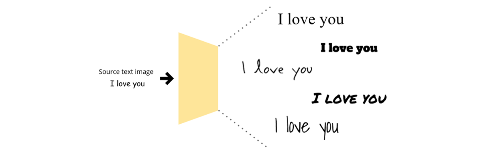
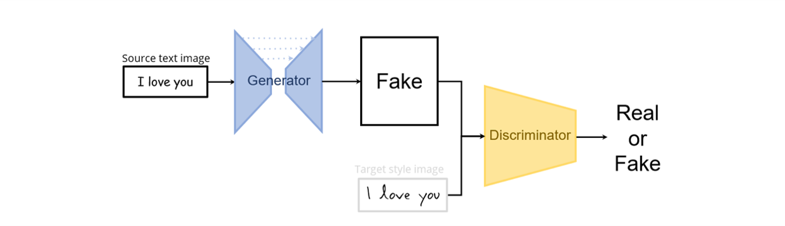
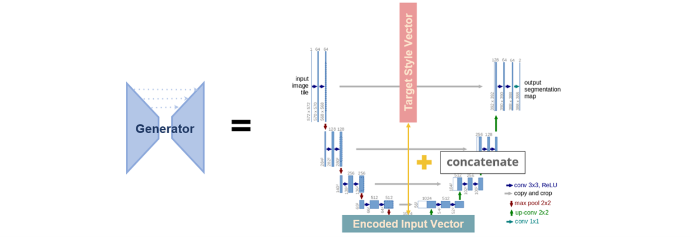
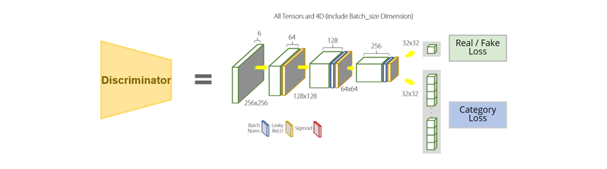
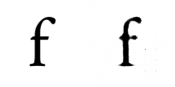

# Font Style Transfer, with GAN & Unet


## Introduction   
This is a project that trains GAN-based model with alphabet characters, and generates various character images through interpolation. This model is an application and extension of the pix2pix model to English characters and words.

<br></br>


<br></br>
## Model Structure


<br></br>
The model structure is GAN, which consists of Generator and Discriminator. It is based off of pix2pix with the addition of category embedding in Generator.
<br></br>
- Generator gets Noto-Sans font type image for input. It works based on U-net which has Encoder and Decoder inside. Generator keep making better generated image during evaluated by Discriminator.


<br></br>
This U-net Architecture is details of Generator. Encoder(Left side) convert input image to encoded input vector. It extracts features of image, and then The Target Style Vector is concatenated with the encoded input vector. This pair-vectors are decoded by Decoder(Right side).

<br></br>
- Discriminator gets Real target style image and Fake image for input, and calculate the probability of them to be seen as the Real target style image. At the same time, it also predicts the category of the font type. Using each Real/Fake Loss and Category Loss allows the discriminator to work in the better direction.



## Results
TBD ...

<br></br>

## How to render
### Dependency
- This work was trained with **Tensorflow 2.5.0, CUDA 11.0 python 3.8.10**.

requirements:
- Python 3.7
- CUDA / cudnn
- Tensorflow 2.5.0
- selenium / webdriver-manager
- Pillow / opencv
- scipy
- skimage
- imageio

```
pip install tensorflow-2.5.0 selenium webdriver-manager Pillow scipy opencv-python skimage imageio
```

### Data set
We collected font data from **Google fonts**.<br>
train datasets = 762 fonts (sans, serif, display) X 62 characters (small letters 26/capital letters 26/numbers 10) <br>

### Get datasets
1. Download package <br>
2. Run data.py
```
python data.py
```
if you run data.py successfully, you can see the structure of folders as below:
```
font-style-transfer
├─ data_modules
├─ eval_modules
├─ pickledata      # Final output of data.py code
├─ resized_img
├─ train_set
├─ ttf_zips
├─ ttf2png
└─ ttfs
```
### Training
```
python train.py \
--data_dir C:/fst/pickledata \
--embedding_name embedding.pickle \
--train_name train.pickle
```
### Training arguments
- `--data_dir`: folder path to pickledata folder<br>
- `--embedding_name`: name of embedding pickle<br>
- `--train_name`: name of train dataset pickle<br>

### Evaluation
If you want to evaluate generated images and use this evaluation code, prepare 256*128 sized evaluation dataset as below<br>


When you get ready for evaluation, run eval.py
```
python eval.py \
--img_path IMG_PATH \
--weight_path WEIGHT_PATH 
```
### Evaluation arguments
- `--img_path`: folder path to paired-concatenated image of **ground truth images and generated images(256X128)**
- `--weight_path`: folder path to pretrained inception classifier weight(62 classes)

<br></br>

## Package directory
```
data/      # Data preprocessing : Web crawling -> image(.png) -> pickle(.pkl)
├─ crawling.py     # make font list from google font & download ttf files
├─ ttf2png.py      # derive image files(png) from ttf file  
├─ preprocess.py   # resize images and concat base font & train font
└─ package.py      # transfer file type & split train/valid set 

eval/      # Evaluate the generated font
├─ eval_prdc.py    # Evaluate by prdc on generated images
├─ eval_IS.py      # Evaluate by IS on generated images
├─ eval_fid.py     # Evaluate by fid on generated images
└─ eval_ssim.py    # Evaluate by ssim on generated images

model/     # GAN : Generator(U-net), Discriminator
├─ load_data.py    # Load data 
├─ model.py        # Encoder, Decoder, Generator, Discrminator
├─ train.py        # Trainer, Save Model & logs
└─ utils.py        # Data preprocessing functions

```

<br></br>

## Acknowledgements
Code derived and rehashed from ; 
- [zi2zi](https://github.com/kaonashi-tyc/zi2zi) by [kaonashi-tyc](https://github.com/kaonashi-tyc)
- [Domain Transfer Network](https://github.com/yunjey/domain-transfer-network) by [yunjey](https://github.com/yunjey)
- [ac-gan](https://github.com/buriburisuri/ac-gan) by [buriburisuri](https://github.com/buriburisuri)
- [dc-gan](https://github.com/carpedm20/DCGAN-tensorflow) by [carpedm20](https://github.com/carpedm20)
- [GAN-handwriting-style](https://github.com/jeina7/GAN-handwriting-styler) by [jeina7](https://github.com/jeina7)

<br></br>

## License
Apache 2.0
